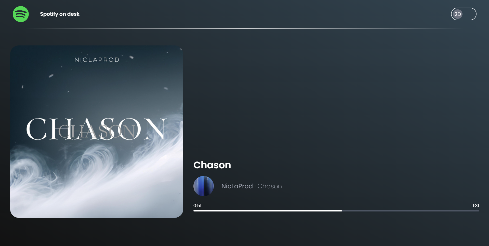
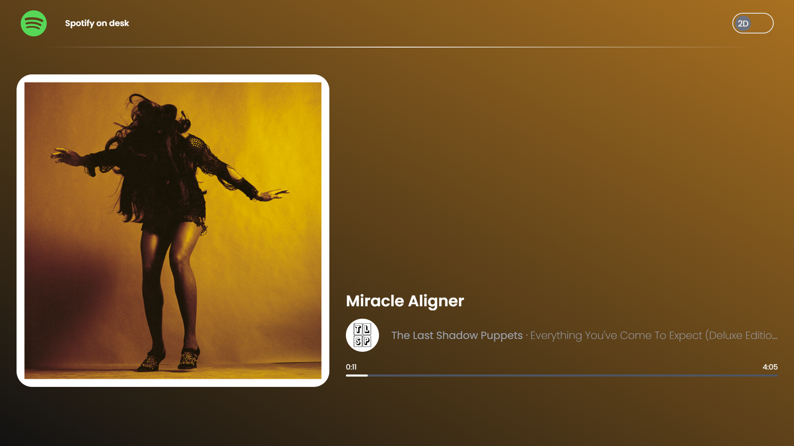
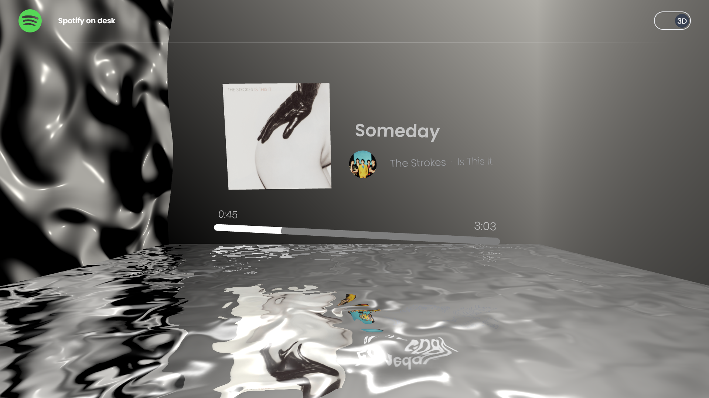
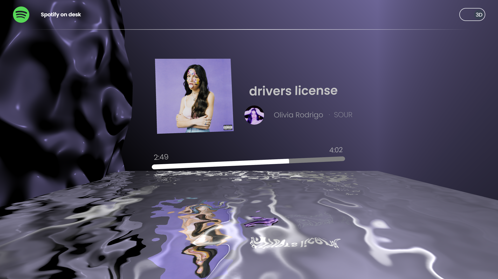

# Spotify on Desk

**Spotify on Desk** is a personal, non-commercial project which is not affiliated with Spotify. It's a web application built with React and the Spotify API that displays the currently playing music. The app offers two distinct modes for visualizing the music:

- **2D Mode**: Displays the current track in a traditional 2D layout.
- **3D Mode**: Presents the track in an interactive 3D scene, featuring Perlin noise and reflection effects. The 3D scene dynamically reacts to the intensity of the track, enhancing the visual experience.

It can be accessed online at https://spotify-on-desk.vercel.app/ (No user information is stored.)

The original purpose of this project was to put this on a desk using a Raspeberry Pi 5 and a small screen to show which music i'm currently listening, as a decoration.

## Features

- **Real-time Music Display**: Connect to Spotify and show the currently playing track.
- **2D Mode**: A straightforward, clean interface to view the track details.
- **3D Mode**: An immersive 3D environment where the visual representation of the track adapts to its intensity.
- **Soft transitions**: The main color of each album cover are used as background and smoothly interpolate when need to change. 

## Screenshots

### 2D Mode



### 3D Mode



## Installation

To get started with **Spotify on Desk**, follow these steps:

1. **Clone the Repository**:
   ```bash
   git clone https://github.com/putonnicolas/spotify-on-desk.git
   cd spotify-on-desk


2. **Install Dependencies**:
   ```bash
   npm install

3. Go on [Spotify developer's website](https://developer.spotify.com/) and create a new app on your personnal dashboard.

4. Set Up Environment Variables: Create a .env file in the root directory and add your Spotify API credentials:
   ```bash
   VITE_SPOTIFY_CLIENT_ID=your_client_id
   VITE_REDIRECT_URI=your_redirect_url

5. Start the Development Server:   
    ```bash
    npm run dev

6. Open Your Browser: Navigate to http://localhost:4000 to see the application in action.

Usage
+ Connect to Spotify: Follow the on-screen instructions to authenticate with your Spotify account.
+ Select Mode: Toggle between 2D and 3D modes using the interface options.
+ Enjoy: Watch the currently playing track visualized in your chosen mode.


## Contributing
Feel free to contribute to the project! Open an issue or submit a pull request to improve or extend the application.

## License
This project is licensed under the MIT License. See the LICENSE file for details.

